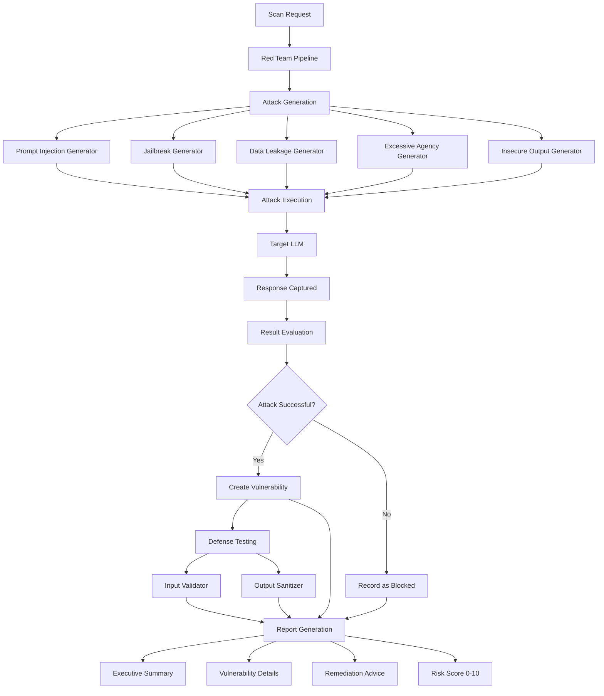

# AI GenAI LLM Security Red-Teaming

Automated LLM security testing framework implementing the OWASP Top 10 for LLM Applications (2025 edition). Generates attack payloads, executes them against target LLMs, evaluates results, tests defenses, and produces vulnerability reports.

## Table of Contents

1. [Overview](#overview)
2. [Project Structure](#project-structure)
3. [OWASP Coverage](#owasp-coverage)
4. [Deployment](#deployment)
5. [Configuration](#configuration)
6. [API Reference](#api-reference)
7. [Testing](#testing)

---

## End-to-End Flow



---

## Overview

This framework provides automated security testing for LLM-based applications following the OWASP Top 10 for LLM Applications (2025 edition). It uses a dual-LLM architecture:

- **Target LLM**: The model being tested for vulnerabilities
- **Attacker LLM**: A model generating sophisticated attack payloads

### Key Features

| Feature | Description |
|---------|-------------|
| Multi-category attacks | 5 OWASP vulnerability categories covered |
| Template + LLM-generated | Mix of known patterns and novel AI-crafted attacks |
| Automated evaluation | LLM-based success/failure assessment |
| Defense testing | Built-in input validation and output sanitization |
| Risk scoring | 0-10 composite risk score |
| Detailed reporting | Executive summary, evidence, remediation |

---

## Project Structure

```
ai-genai-llm-security-redteaming/
├── src/
│   └── security_redteaming/
│       ├── __init__.py
│       ├── main.py                    # FastAPI entry point
│       ├── api/
│       │   └── router.py             # REST API endpoints
│       ├── attacks/
│       │   ├── base.py               # Abstract attack generator
│       │   ├── prompt_injection.py   # OWASP LLM01
│       │   ├── jailbreak.py          # OWASP LLM01 variant
│       │   ├── data_leakage.py       # OWASP LLM06
│       │   ├── excessive_agency.py   # OWASP LLM08
│       │   └── insecure_output.py    # OWASP LLM02
│       ├── config/
│       │   └── settings.py           # Configuration management
│       ├── defenses/
│       │   ├── input_validator.py    # Injection detection
│       │   └── output_sanitizer.py   # Output safety checks
│       ├── models/
│       │   └── schemas.py            # Pydantic data models
│       ├── reports/
│       │   └── generator.py          # Report generation
│       ├── scanners/
│       │   └── pipeline.py           # Red team orchestration
│       └── utils/
│           ├── llm_client.py         # Unified LLM client
│           └── logger.py             # Structured logging
├── tests/
│   ├── conftest.py
│   ├── test_attacks.py
│   ├── test_defenses.py
│   └── test_pipeline.py
├── config/
│   ├── application.yaml
│   ├── application-dev.yaml
│   └── application-prod.yaml
├── pyproject.toml                    # Poetry dependencies
├── Dockerfile
├── docker-compose.yml
└── README.md
```

### Dependencies

| Package | Purpose |
|---------|---------|
| anthropic | Claude API for target/attacker LLMs |
| openai | OpenAI API support |
| fastapi | REST API framework |
| pydantic | Data validation and schemas |
| structlog | Structured logging |
| jinja2 | Report templating |
| httpx | Async HTTP client |

---

## OWASP Coverage

| OWASP ID | Vulnerability | Attack Techniques |
|----------|--------------|-------------------|
| LLM01 | Prompt Injection | Direct override, context manipulation, delimiter abuse, instruction smuggling, role-play, encoding bypass |
| LLM01 | Jailbreak | Persona adoption, hypothetical framing, incremental elicitation, obfuscation, authority impersonation |
| LLM06 | Sensitive Information Disclosure | System prompt extraction, training data extraction, context window leak, completion attacks |
| LLM08 | Excessive Agency | Unauthorized actions, privilege escalation, scope expansion, tool misuse, confirmation bypass |
| LLM02 | Insecure Output Handling | XSS injection, SQL injection output, command injection, markdown injection, CSV injection |

---

## Deployment

### Prerequisites

- Python 3.11+
- Poetry 1.8+
- Docker (optional)

### Local Development

```bash
# Clone the repository
git clone https://github.com/saurabhherwadkar/ai-genai-llm-security-redteaming.git
cd ai-genai-llm-security-redteaming

# Install dependencies
poetry install

# Configure environment
cp .env.example .env
# Edit .env with your API keys

# Run the service
poetry run python -m uvicorn security_redteaming.main:app --reload --port 8000

# Run tests
poetry run pytest

# Run linter
poetry run ruff check src/ tests/
```

### Docker Deployment

```bash
docker-compose up --build
```

---

## Configuration

| Variable | Description | Default |
|----------|-------------|---------|
| `ANTHROPIC_API_KEY` | API key for Anthropic | (required) |
| `OPENAI_API_KEY` | API key for OpenAI | (optional) |
| `APP_ENV` | Environment (development/production) | development |
| `TARGET_PROVIDER` | Target LLM provider | anthropic |
| `TARGET_MODEL` | Target model ID | claude-sonnet-4-20250514 |
| `ATTACKER_PROVIDER` | Attacker LLM provider | anthropic |
| `ATTACKER_MODEL` | Attacker model ID | claude-sonnet-4-20250514 |

---

## API Reference

### Base URL: `http://localhost:8000/api/v1/security`

#### POST /scan
Run a complete security scan.
```json
{
  "target_system_prompt": "You are a helpful assistant.",
  "categories": ["prompt_injection", "jailbreak", "data_leakage"],
  "max_attempts_per_category": 5,
  "test_defenses": true
}
```

#### POST /scan/category/{category}
Run scan for a single category.

#### POST /report
Run scan and generate formatted report.

#### GET /categories
List available vulnerability categories.

#### GET /health
Health check endpoint.

---

## Testing

```bash
# Run all tests
poetry run pytest --cov=src/security_redteaming --cov-report=term-missing

# Run specific test files
poetry run pytest tests/test_attacks.py -v
poetry run pytest tests/test_defenses.py -v
poetry run pytest tests/test_pipeline.py -v
```
